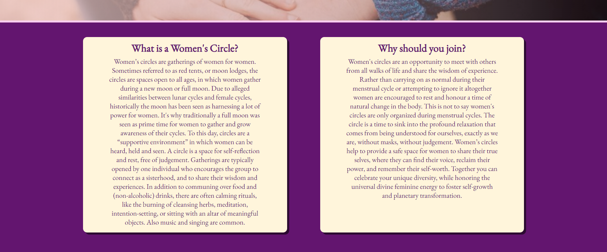
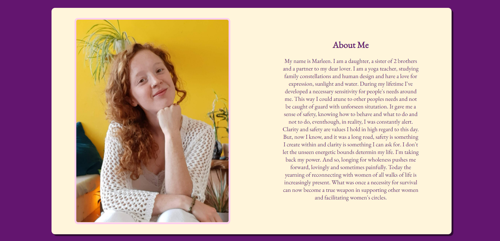
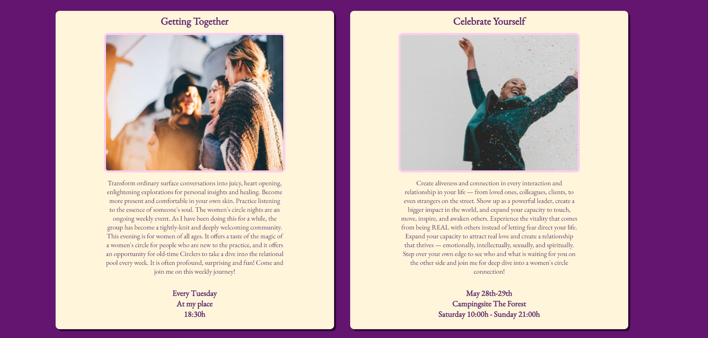
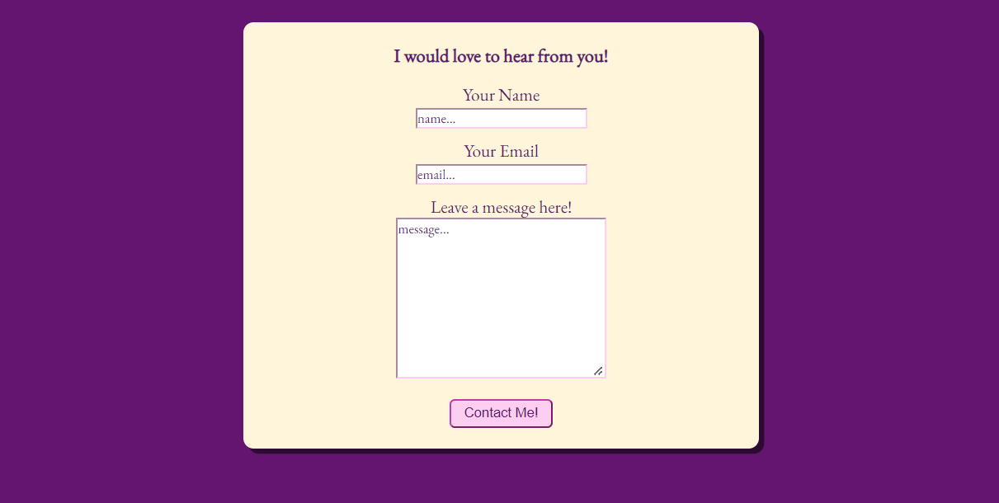
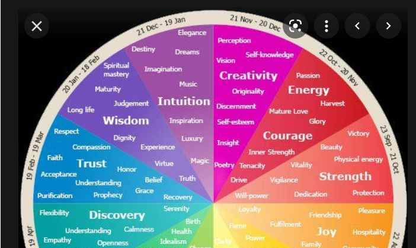
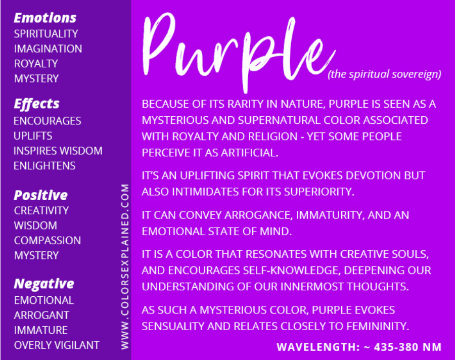
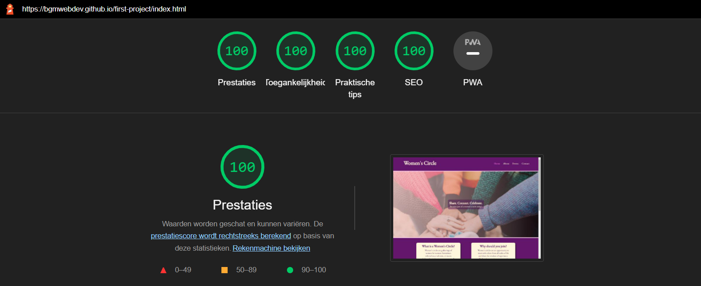
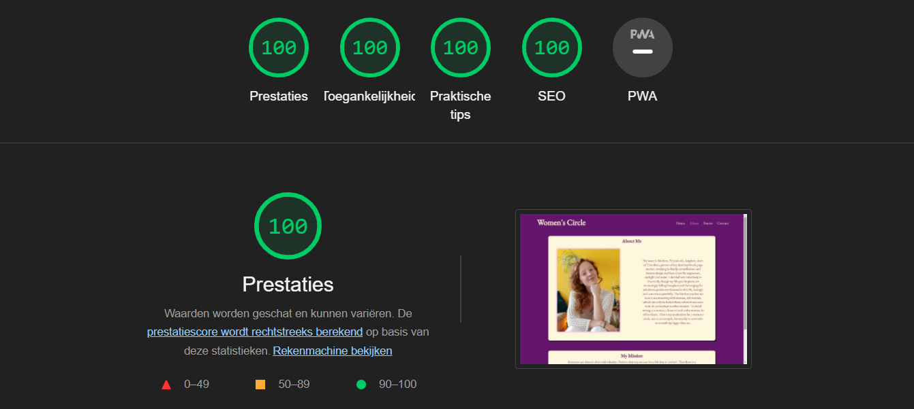
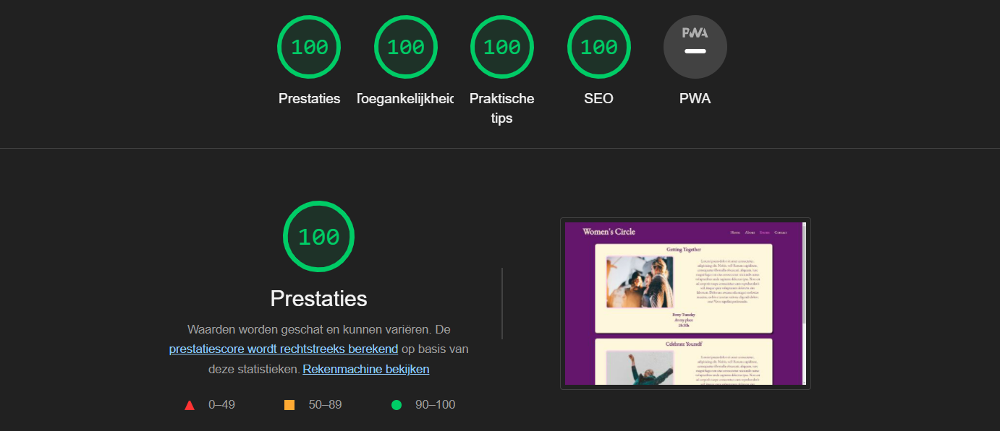
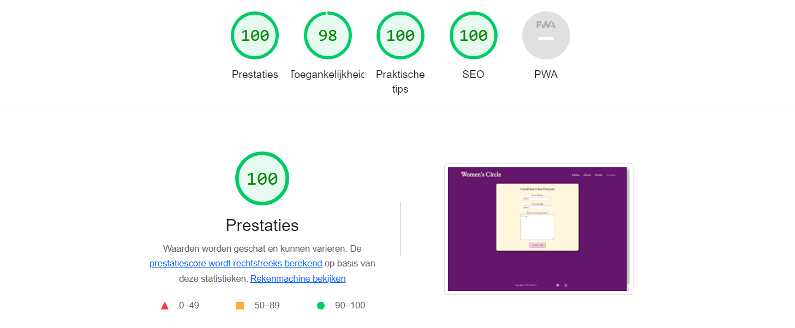

# Women's Circle

## Introduction

Women should connect with other women, share their experience, and celebrate being women together! There is a lot of value in connection. To see others and be fully seen. A sense of acceptance, coming home, feeling safe, being able to truly relax and let go and even celebrate who you are. 
This website will be targeted towards all women young and old from all walks of life, to provides awareness around the value of support and connection among women and make it accesible for them to reach out and even participate.  

## Table of content

- [Introduction](#introduction)

- [Features](#features) 
    - Navigation bar
    - Landing page
    - What and why
    - Footer
    - About me
    - Mission
    - Events
    - Gallery
    - Contact form

- [Wireframes](#wireframes)

- [Design choices](#design-choices)

- [Features for the future](#features-for-the-future)

- [Languages used](#languages-used)

- [Testing](#testing)
    - Responsive design
    - Validation testing
    - Bugs & errors

- [Deployment](#deployment)
    - Steps
    - Live link

- [Credits](#credits)
    - Content
    - Media

-----

### Features
- Navigation bar
    - The fully responsive navbar is a feature that is presented on all pages. It contains the websites logo, and a navigation menu that is easily recognised.
    - The navigation bar is present on all pages to make navigating between pages easy, and there is no need for use of the back button in the browser window. 
    - The navigation menu contains a hover effect to make the user experience more pleasent. It will show an underline. 
    - The navigation bar also contains an 'active' function, which is shown by discoloration of the active page name in the menu. The user can see on which page they currently are.

- Landing page
    - The landing page has a background image to immediately draw in attention, and trigger curiosity. The image creates a sense of togetherness. With the gradient set as it is, it also creates something dreamy, something to long for. 
    - In the center there is an overlay of text with core principles of what a women's circle is about. The words are very relatable and speak to the needs of women. 

- What and Why
    - Underneath the landing page image, the user is directly introduces to information around what a women's circle is and why they should join, or what the value could be for them. 
    - The placing makes it easy for the user to immediatly get their curiosity met with en explaination.

- Footer
    - The footer contains a copyright.
    - The footer also contains social media links to my client's personal pages. This will allow the user to get instant acces to who she is and connect through social media. 
    - The links will create easy acces to social media, and will open in a seprate window.
    - This feature will be present on all pages. 

- About me
    - In this feature the user can get to know the person behind the webpage, maybe even relate to the personal story. 
    - There is a picture presented for the user to connect to a real person, to make it more personal.

- Mission
    - This feature will make the user part of something bigger. It is a dream the user is invited to. 
    - The mission statement will be another call to action for women, and hopefully will get women motivated to take part. 

- Events
    - There are two different events the user can participate in, making it accesible to different needs and/or agenda's. 
    - The two event cards show all the information needed, which makes it very easy and clear.
    - The added images are there to set the tone, create a mood and invite. 

- Gallery
    - This feature will allow the user to get a better impression of what the women's circle is. 
    - The images have a enlarge effect on hover, which makes the experience very easy and pleasant.  

- Contact form
    - This feature will allow for users to get in touch with my client. Either to ask a question or to sign up for participation. 
    - The user will be asked to fill in their name and email adress. There is also space for questions or comments. 

### Wireframes
- Wireframe of the landing page:

- Wireframe of the about page:

- Wireframe of the events page:

- Wireframe of the contact page:

- Wireframe fo the smartphone landing page:

- Wireframe fo the smartphone about page:

- Wireframe fo the smartphone events page:

- Wireframe fo the smartphone contact page:

### Design choices
- I picked purple as the primary color of the website. Purple is associaded with wisdom, spirituality, truth, inspiration, imagination and also royalty. I picked a contrasting color that would fit well and have a soft warm sense to it. For details I picked a light pink, which is often associated with femininity, self knowledge and creativity. As you will be able to read in the testing section, the contrast has been tested. 

The chart was found on [Pinterest](https://nl.pinterest.com/pin/213709944790337176/)

The color explanation was found on [Colors Explained](https://www.colorsexplained.com/color-purple-meaning-of-the-color-purple/)

### Features for the future
- A testimonial section, or user story section, where users can read about or even view (video content) the experience of other users. This will add to reliablility of information.
- A blog section where the user can read and relate to stories. This way a broader public can be reached. 

### Languages used
- This website makes use of two languages:
    - HTML for the frame
    - CSS for the styling of the page

### Testing
- Responsive design
    - This website is tested for responsive design through the use of different size settings in chrome dev-tools.
    - Responsivity is also tested on http://ami.responsivedesign.is/ (see image at the top) and on https://www.responsinator.com/ where also different viewport sizes are presented.
    

- Validation testing
    - W3C Jigsaw CSS Test:[W3C HTML Validator](https://jigsaw.w3.org/css-validator/#validate_by_input).
    - Uploaded stylesheet daily.
    - Made all necessary changes.
    - Ran test again to verify all CSS passed.
    <!-- I'm sorry the image has Dutch text in it, it says; "Congratulations! no mistakes found." -->

    - W3C HTML Test:[W3C HTML Validator](https://validator.w3.org/nu/#textarea).
    - Ran every html file daily (if there were changes).
    - Made all necessary changes.
    - Ran test again to verify all HTML passed.

    - The website is also validated for it's color contrast through https://webaim.org/resources/contrastchecker/ and through https://coolors.co/contrast-checker/fff5da-63156f

    - lighthouse
    Lighthouse is used in chrome dev tools to check performance and accessibility.
    (add scores and images!!)

- Bugs & errors
    - Image on about page wasn't rendering. I was advices on slack to change file path to relative path. This fixed the problem.

### Deployment

The steps taken to deploy the website :

1. In the GitHub repository, navigate to the Settings tab
2. Scroll down to Github pages
2. From the source section drop-down menu, select the main branch
3. Once the main branch has been selected, click "Save"
4. GitHub will display a message confirming that the site has been deployed successfully
5. GitHub will provide a link to the deployed site
6. Click on the link to view the site has deployed in a new tab

The live link the deployed project can be found here: [Women's-circle](https://bgmwebdev.github.io/first-project/)

### Credits

- Content
    - For the gradient overlay on the image I used the code from [Webdevetc](https://webdevetc.com/blog/how-to-add-a-gradient-overlay-to-a-background-image-using-just-css-and-html/) and tweaked it to my own preferences. 
    - As inspiration for and to learn about responsive footer, I looked at the video of [Future Coders](https://www.youtube.com/watch?v=2-5LpaN2LF8) 
    - To get inspired about mobile first responsive build I watched the video series of [Netninja](https://www.youtube.com/watch?v=PM3XW_1RAIs&list=PL4cUxeGkcC9hH1tAjyUPZPjbj-7s200a4)
    - To learn about and choose between flexbox or grid I watched the video of [Kevin Powell](https://www.youtube.com/watch?v=3elGSZSWTbM)
    - To understand how to enlarge an image on hover, I watched this video of [WebZone](https://www.youtube.com/watch?v=Zz8A4NqoLrE) and used the css for hover.
    - To learn about responsive form I watched the video from [Dev_A.T_Viet_Nam](https://www.youtube.com/watch?v=ebsIkJHGuIA)
    - How to style placeholder text I found and used from [w3schools](https://www.w3schools.com/cssref/sel_placeholder.asp)
    - How to style buttons I also found and used from [w3schools](https://www.w3schools.com/css/css3_buttons.asp)

    In general [3wschools](https://www.w3schools.com/) was a great place to find information, as was [MDN](https://developer.mozilla.org/en-US/), [Google](https://www.google.com/?&bih=754&biw=1536&hl=nl) and [Youtube](https://www.youtube.com/).

- Media
    - image resources are [Unsplash](https://unsplash.com/) and [Pexels](https://www.pexels.com/nl-nl/)
        - The hero-image background is from [Hannah Busing](https://unsplash.com/s/photos/women-group)
        - The about me image is from my private collection
        - The top event image is from [Priscilla du Preez](https://unsplash.com/s/photos/women)
        - The bottom event image is from [clay banks](https://unsplash.com/s/photos/women-celebrate)
        - The images in the gallery are from [Rosie Sun](https://unsplash.com/s/photos/women), [Garon Piceli](https://www.pexels.com/nl-nl/zoeken/women/), [Sam Manns](https://unsplash.com/s/photos/women-group), [Tim Marshall](https://unsplash.com/s/photos/women-circle).

    - The icons in the footer are from [FontAwesome](https://fontawesome.com/)

    - text content about the women's circles
        - The content of what is a women's circle, why should you join and the mission statement is mostly copied and pasted from [Vogue](https://www.vogue.co.uk/article/) and [Kelleemaize](https://www.kelleemaize.com/post/how-to-plan-and-host-a-womens-circle), with some alterations here and there and some input from my partner, Marleen, her own experience to fit this website 
        - The events content is taken from [Circling Institute weekend](https://circlinginstitute.com/weekend-intensives/) and [Circling Institute night](https://circlinginstitute.com/drop-in-circling-night/)
				 
